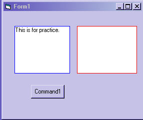



## textboxBorderOCX \-updated

### Description

This is an update to my previous submission. It does not use shapes this time.I hope I got enough of the right properties to make this useful and flexible. Have fun and Howdy from Texas
 
### More Info
 

             |
---                |---
**Submitted On**   |2004-02-19 19:31:48
**By**             |[Kenneth Foster](https://github.com/Planet-Source-Code/PSCIndex/blob/master/ByAuthor/kenneth-foster.md)
**Level**          |Intermediate
**User Rating**    |5.0 (10 globes from 2 users)
**Compatibility**  |VB 6\.0
**Category**       |[Custom Controls/ Forms/  Menus](https://github.com/Planet-Source-Code/PSCIndex/blob/master/ByCategory/custom-controls-forms-menus__1-4.md)
**World**          |[Visual Basic](https://github.com/Planet-Source-Code/PSCIndex/blob/master/ByWorld/visual-basic.md)
**Archive File**   |[textboxBor1710972192004\.zip](https://github.com/Planet-Source-Code/kenneth-foster-textboxborderocx-updated__1-51881/archive/master.zip)

